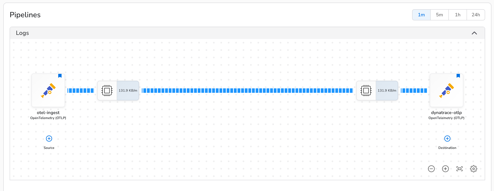
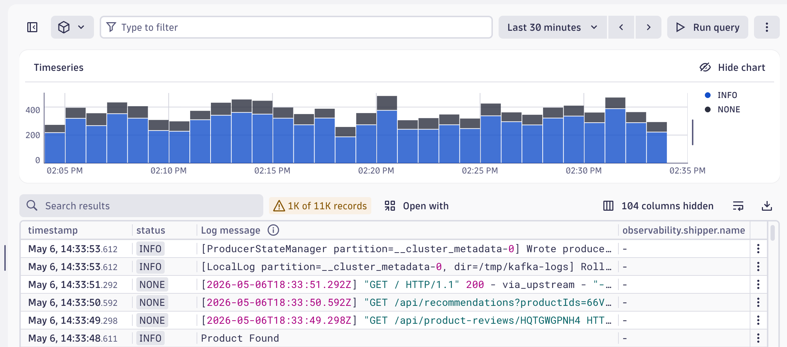
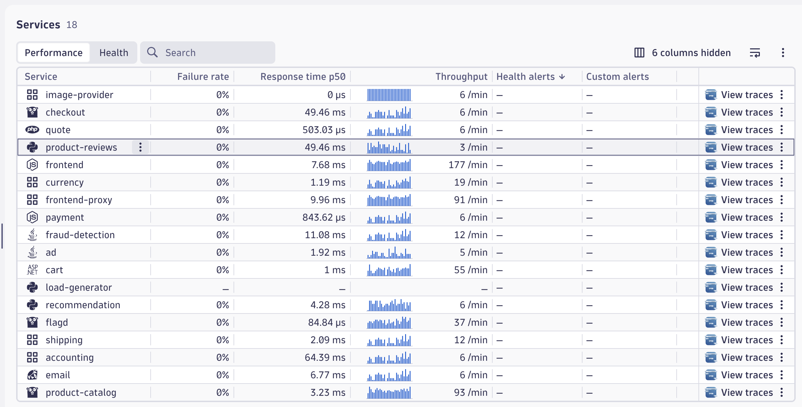

# Dynatrace Bindplane Sandbox

A bootsrapped Bindplane pipeline that ships from the Otel Demo to Dynatrace.

## What This Repo Deploys

The Terraform in `terraform/` manages:

1. EKS cluster + node group + IAM
2. VPC/subnets in one of three networking modes
3. Bindplane Cloud control-plane objects (OTLP source, Dynatrace destination, collector configuration)
4. Bindplane Cloud collector agents (applies Bindplane-generated Kubernetes manifest via kubectl)
5. OTel Demo Helm release with embedded collector exporting to Bindplane
6. Dynatrace credentials as a Kubernetes Secret (never in Helm values or plan output)

## Prerequisites

- Terraform `>= 1.5`
- AWS CLI configured (`aws configure`)
- kubectl (to deploy Bindplane manifests)
- A Bindplane Cloud account with an API key
- A Dynatrace environment with an API token scoped for:
  - `openTelemetryTrace.ingest`
  - `metrics.ingest`
  - `logs.ingest`

## 1. Configure Terraform Backend

S3 is the preferred backend for any use beyond a single quick run — it keeps state safe if you lose your local directory or move machines.

**Option A — S3 (recommended):**

Create an S3 bucket and edit a copy of the backend.vars file:

```bash
cp backend.tfvars.example backend.tfvars
# edit backend.tfvars with your bucket, key, and region
terraform init -backend-config=backend.tfvars
```

**Option B — local state (no S3 required):**

Stores your state locally.

```bash
terraform init -backend=false
```

State is written to `terraform.tfstate` in the working directory. No source files need to be changed. If you later want to move to S3, run `terraform init -migrate-state -backend-config=backend.tfvars`.

## 2. Configure Deployment Variables

```bash
cp terraform.tfvars.example terraform.tfvars
```

Edit `terraform.tfvars`. The file is organized into clear sections — the top **ENVIRONMENT VALUES** section is what you edit. At minimum set:

| Variable | Description |
| --- | --- |
| `region` | AWS region |
| `cluster_name` | EKS cluster name |
| `bindplane_provider_remote_url` | Your Bindplane Cloud tenant URL |
| `bindplane_provider_api_key` | Bindplane Cloud API key |
| `dt_tenant_url` | Dynatrace tenant base URL (environment ID is derived from this) |
| `dt_api_token` | Dynatrace API token |

The `otel_collector_config` variable in `terraform.tfvars` is pre-configured with an OTLP exporter that sends to the Bindplane service. You typically don't need to modify this unless you want to customize the embedded collector's pipeline.

The **PHASE-CONTROLLED TOGGLES** section at the bottom of `terraform.tfvars` is shown for reference only — do not edit those values manually. They are overridden by the phase overlay files described in section 4.

### Networking mode

Choose one networking mode in `terraform.tfvars`:

1. **Default VPC + existing subnets** (default): leave all four networking vars `null`. The cluster will use your AWS account's default VPC and automatically select existing subnets.
2. **Existing/default VPC + dedicated project subnets**: Use an existing VPC (leave `vpc_cidr` as `null` to use the default VPC). Set `public_subnet_cidrs` and `private_subnet_cidrs` to create new subnets with your chosen CIDR blocks for this cluster.
3. **New custom VPC**: set `vpc_cidr` to create a new VPC (subnets auto-derived if `public_subnet_cidrs` and `private_subnet_cidrs` are not specified).

Node group is placed on public subnets in modes 1 and 2. NAT gateway is only created for mode 3.

## 3. Phase Overlays

This repo uses phase overlay files in `terraform/phases/` to control deployment-stage toggles. This allows you to deploy in "phases", making it easier to troubleshoot anything that may go wrong and avoids very long-running terraform operations. You pair one overlay with your `terraform.tfvars` to activate the phase you want to run.

The build is broken down into three phases:

| Phase overlay | `deploy_otel_demo` | `deploy_bindplane_controlplane` | `deploy_embedded_collector` | Purpose |
| --- | --- | --- | --- | --- |
| `phases/01-infra.tfvars` | `false` | `false` | `true` | Create AWS infrastructure only (EC2, EKS, subnets, IAM, etc) |
| `phases/02a-bindplane.tfvars` | `false` | `true` | `true` | Create Bindplane cloud resources  |
| `phases/02b-bootstrap-collector.tfvars` | `false` | `true` | `true` | Applies the Bindplane Cloud collector bootstrap manifest, deploying the agents according to the config on Bindplane cloud  |
| `phases/03-demo-external-collector.tfvars` | `true` | `true` | `true` | Deploys OTel demo with embedded collector exporting to Bindplane |

**Note:** `deploy_embedded_collector` is always `true` because this repo uses the OTel Demo's built-in collector (vs. an external standalone collector). It only takes effect when the demo is deployed in phase 3.

All terraform commands below should be run from inside the `terraform/` directory:

```bash
cd terraform
```

Create the direcory to store the terraform plans:
```bash
mkdir -p plans
```

## 4. Phase 1: Deploy Infrastructure

```bash
terraform plan \
  -var-file=terraform.tfvars -var-file=phases/01-infra.tfvars -out=plans/01-infra.tfplan
```
The plan will be calculated and written to disk.

Apply it to create the resources:
```bash
terraform apply plans/01-infra.tfplan
```

This should take about 15-20 minutes


Once complete, configure your local kube context:
(also should be output by terraform after `apply` is done)
```bash
aws eks update-kubeconfig --region <region> --name <cluster_name> --alias <context_alias>
kubectl config use-context <context_alias>
```

## 5. Phase 2: Apply Bindplane Cloud Control Plane

This phase creates the Bindplane OTLP source, Dynatrace destination, and collector configuration in your Bindplane Cloud.

```bash
terraform plan \
  -var-file=terraform.tfvars \
  -var-file=phases/02a-bindplane.tfvars \
  -out=plans/02a-bindplane.tfplan
```
```bash
terraform apply plans/02a-bindplane.tfplan
```

### Bootstrap collectors into the cluster

Bindplane Cloud requires a **fleet** to manage collectors. Fleets cannot be created via Terraform (no `bindplane_fleet` resource exists), so you'll create one manually in the UI and download the generated Kubernetes manifest.

First, get your configuration name from Terraform output:
```bash
terraform output bindplane_configuration_name
```

Go to Bindplane Cloud and create a fleet using these settings:

- Platform: **Kubernetes**
- Agent Type: **BDOT 1.x** (or the current stable version)
- Platform specifics: **Node** (DaemonSet deployment)
- Fleet name: anything meaningful for your project (e.g., your cluster name)
- Click **Next**
- Choose the configuration created by Terraform (use the name from the output above)

After creating the fleet, download the Kubernetes manifest:

1. Click **"Install Agent"** in the Bindplane UI
2. Choose the same platform settings:
   - Platform: Kubernetes
   - Agent Type: BDOT 1.x
   - Platform specifics: Node
3. Select the fleet you just created
4. Click **Next** and download the generated `bindplane-agent.yaml` manifest

If you choose a different platform or agent family here, the generated install manifest will not match the Kubernetes-based collector deployment this repo expects.

You have two options on how to deploy and manage it:

**Option A — Terraform-managed (recommended):**

1. Save it to `terraform/bindplane-agent.yaml`.
2. In your `terraform.tfvars`, confirm `bindplane_bootstrap_manifest_path` matches where you saved the file.
3. Run the bootstrap overlay:

```bash
terraform plan \
  -var-file=terraform.tfvars \
  -var-file=phases/02b-bootstrap-collector.tfvars \
  -out=plans/02b-bootstrap-collector.tfplan
```

```bash
terraform apply plans/02b-bootstrap-collector.tfplan
```

Terraform will run `kubectl apply -f` against the manifest, saving the state.  kubectl must be pointed at the cluster (previous step 4 kube context).

**Option B — Manual:**

Or you can apply Bindplane-generated manifest yourself:

```bash
kubectl apply -f bindplane-agent.yaml
```
Same net effect, but terraform will not be aware of the state.


**Validate that the manifest was applied **


Once collectors are running, verify they're healthy:

```bash
kubectl get pods -n bindplane-agent
```

You should see DaemonSet pods (typically 1 per node) in Running status. The Bindplane collectors are now ready to receive telemetry from the demo application.

## 6. Phase 3: Deploy OTel Demo Apps

With Bindplane collectors running:

```bash
terraform plan \
  -var-file=terraform.tfvars \
  -var-file=phases/03-demo-external-collector.tfvars \
  -out=plans/03-demo-external-collector.tfplan
```

```bash
terraform apply plans/03-demo-external-collector.tfplan
```

This deploys the OTel demo chart with its embedded collector configured to export all telemetry to your Bindplane-managed collectors.

**How telemetry flows:**
1. Demo services → embedded OTel collector (sidecar within the demo)
2. Embedded collector → Bindplane agents at `bindplane-node-agent.bindplane-agent.svc.cluster.local:4317` (gRPC)
3. Bindplane agents → Dynatrace

The embedded collector's OTLP exporter is configured in `terraform.tfvars` via the `otel_collector_config` variable.

## 7. Verify

### Bindplane
Check your configuration in Bindplane Cloud to see that data is passing through the pipeline you created:



### Dynatrace
You should see all of the services and telemetry data you'd expect from the otel demo in Dynatrace:




### Otel Demo (Astronomy Shop) frontend
If you want to view the exposed frontend of the otel demo, or to click through to generate specific telemetry use cases:

```bash
kubectl -n otel-demo port-forward svc/frontend-proxy 8080:8080
```

Open `http://localhost:8080`.


**You now have a working end-to-end telemetry pipeline!** 
Feel free to add any components to your configuration (processors, connectors, etc) to refine your telemetry data!

## 8. Clean Up

To tear down all resources created by Terraform, use the same phase overlay as your last apply:

```bash
terraform destroy -var-file=terraform.tfvars -var-file=phases/03-demo-external-collector.tfvars
```

**Note:** If you manually applied the Bindplane manifest (Option B in Phase 2b), you'll need to manually delete it:
```bash
kubectl delete -f bindplane-agent.yaml
```

The Bindplane Cloud **fleet** and any manually created resources in the Bindplane UI are not managed by Terraform and won't be deleted automatically.

---

## Reference

### Dynatrace configuration notes

The Bindplane-managed collectors send telemetry to Dynatrace at:

```text
<dt_tenant_url>/api/v2/otlp
```

Set `dt_tenant_url` to the base URL of your Dynatrace environment — whatever hostname your tenant actually uses. Do not use `.apps` URLs; OTLP ingest uses the environment host directly. Examples:

```text
https://abc12345.live.dynatrace.com
https://abc12345.sprint.dynatracelabs.com
https://my-managed-instance.example.com/e/abc12345
```

### Optional self-hosted Bindplane server

This repo supports deploying a self-hosted Bindplane server via Helm, but it is not the primary path. Enable it only if you are intentionally running Bindplane outside of Bindplane Cloud:

```hcl
deploy_bindplane_server = true
```

Also set `bindplane_admin_username`, `bindplane_admin_password`, `bindplane_sessions_secret`, `bindplane_license`, and `bindplane_helm_values.backend.type` in `terraform.tfvars`. See the **OPTIONAL SELF-HOSTED BINDPLANE** section of `terraform.tfvars.example` for details.

### Custom shipper attributes on logs

This repo stamps logs with:

- `observability.shipper.name = otel-collector-oss`
- `observability.shipper.version = 0.142.0`

### Troubleshooting

**`terraform apply` hangs on Helm upgrade**

```bash
helm -n otel-demo status otel-demo
kubectl -n otel-demo get pods
kubectl -n otel-demo get events --sort-by=.lastTimestamp | tail -50
```

